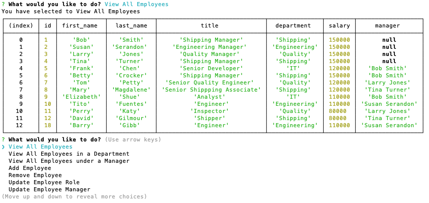

# employee-tracker
## Description

I wrote this program to provide a command line interfcace (CLI) to a database of employees.  This application would allow a business owner to view and manage their departments, roles and employees in their company.  The user can view, add and remove employees as well as changing the employee's department and/or role.  The user can also view, add and remove departments.  The user can also view, add and remove roles.  The user can view the salary budget for each department. 

[Demo video (part 1)](https://drive.google.com/file/d/1acDptRrjyA_5bqikEXysN5wIevvsUm0i/view)

[Demo video (part 2)](https://drive.google.com/file/d/1fOZn6pzrF-vcjuYi7__uwgKB31fBUdqa/view)

## Table of Contents
- [Installation](#installation)
- [Usage](#usage)
- [Credits](#credits)
- [Questions](#questions)
- [License](#license)

## Installation
If someone wanted to install this program they should copy the files from the repo, create a database named *employee_cms* and run *npm i* to install the dependencies.  running npm start will start the program.
## Usage
Once the user has run *npm start* to start the application they can follow the instructions in the command line menu system to choose the various functions.  The on screen prompts will direct the user as to what data is required at each step of the process.
## Credits
This application uses the npm modules dotenv (to enable to offload the database parameters to an .env file), inquirer (to provide the CLI functionality), mysql (to provide the interface to the database) and console (to provide the console.table function for reporting the results of the queries).  
## Questions
If you have any questions you can contact the author through his github user profile: https://github.com/bdstpierre
or by sending an email to barry@stpierre.com
## License
Copyright 2021 Barry St. Pierre

    Permission is hereby granted, free of charge, to any person obtaining a copy of this software and associated documentation files (the "Software"), to deal in the Software without restriction, including without limitation the rights to use, copy, modify, merge, publish, distribute, sublicense, and/or sell copies of the Software, and to permit persons to whom the Software is furnished to do so, subject to the following conditions:
    
    The above copyright notice and this permission notice shall be included in all copies or substantial portions of the Software.
    
    THE SOFTWARE IS PROVIDED "AS IS", WITHOUT WARRANTY OF ANY KIND, EXPRESS OR IMPLIED, INCLUDING BUT NOT LIMITED TO THE WARRANTIES OF MERCHANTABILITY, FITNESS FOR A PARTICULAR PURPOSE AND NONINFRINGEMENT. IN NO EVENT SHALL THE AUTHORS OR COPYRIGHT HOLDERS BE LIABLE FOR ANY CLAIM, DAMAGES OR OTHER LIABILITY, WHETHER IN AN ACTION OF CONTRACT, TORT OR OTHERWISE, ARISING FROM, OUT OF OR IN CONNECTION WITH THE SOFTWARE OR THE USE OR OTHER DEALINGS IN THE SOFTWARE.
    

